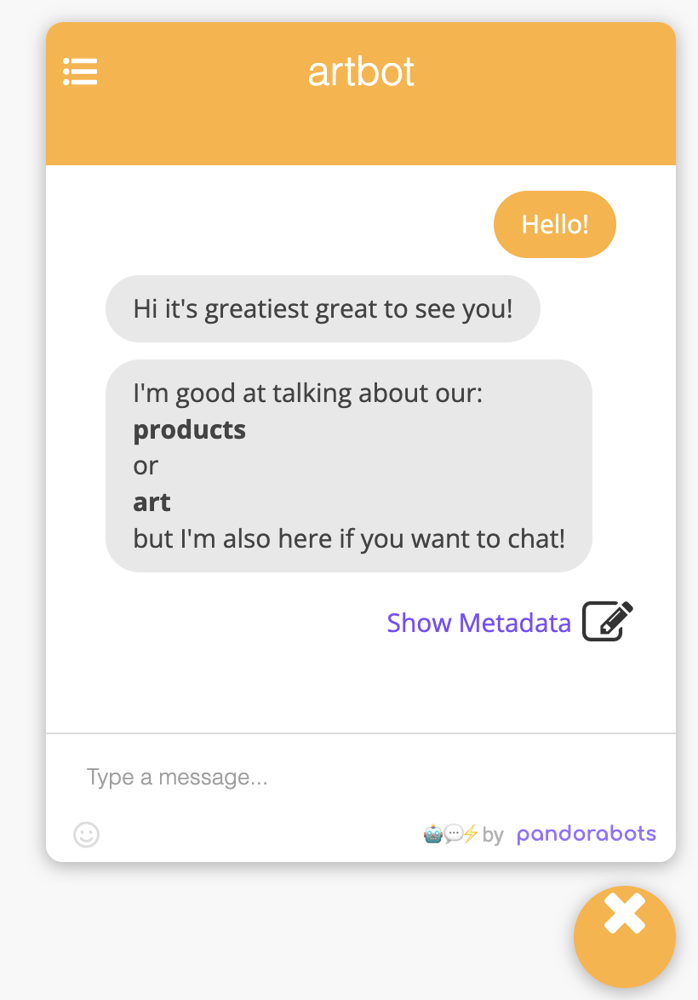
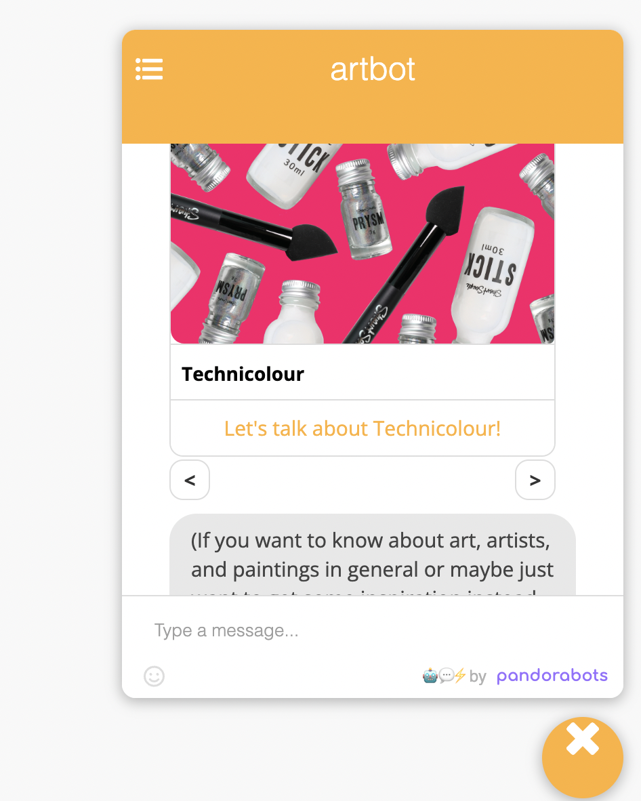
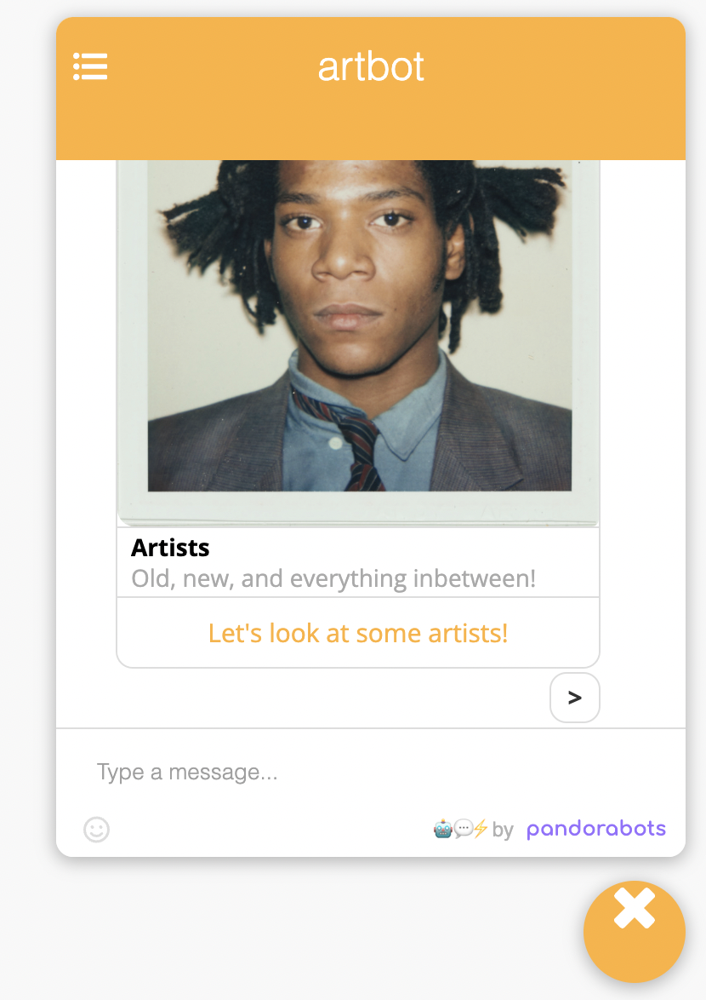

<h1 align="center">🤖 Art-Bot</h1>

🎨 Repository for 'Art Bot' AIML 2.0 Chatbot. Used with Pandorabots CI/CD framework and integrated into Shopify templated shop website.

🖼️ Intended for customer support with products and general art content.

Paid work - Company website overhauled years after leaving (may or may not be in use still)

